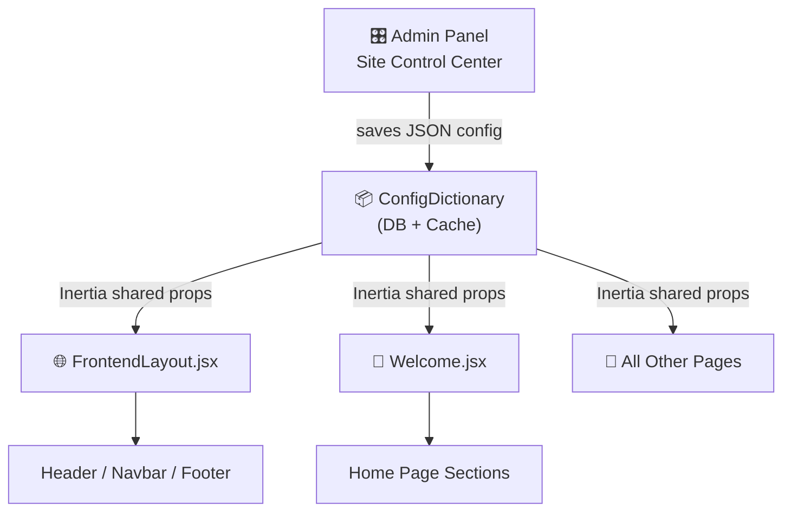

# 🎛️ Centralized Frontend Control Panel — Implementation Plan

## Problem Statement
বর্তমানে ফ্রন্টএন্ডের সবকিছু (নেভিগেশন, ফুটার, সেকশন, ব্র্যান্ডিং, সোশ্যাল লিংক) হার্ডকোডেড। কোনো পরিবর্তন করতে হলে কোড এডিট করতে হয়। অ্যাডমিন একটি সিঙ্গেল ড্যাশবোর্ড থেকে পুরো ফ্রন্টএন্ড নিয়ন্ত্রণ করতে চান — **কোডে হাত না দিয়ে।**

---

## 🏗️ Proposed Architecture: `SiteConfig` System

একটি **সেন্ট্রাল কনফিগারেশন টেবিল** (`config_dictionaries`) ইতোমধ্যেই আছে এবং কাজ করছে। আমরা এই সিস্টেমকে ১০x শক্তিশালী করব:



---

## Proposed Changes

### Phase 1: Backend — Config Keys & Shared Data Pipeline

---

#### [NEW] Migration: `add_site_config_defaults`
একটি নতুন মাইগ্রেশন যা `config_dictionaries` টেবিলে সকল নতুন কনফিগ কী গুলো ডিফল্ট ভ্যালু সহ সিড করবে।

**নতুন Config Keys (grouped):**

| Group | Key | Type | Purpose |
|-------|-----|------|---------|
| **Branding** | `site_name` | string | সাইটের নাম (যেমন: "Young Technical Training Centre") |
| **Branding** | `site_tagline` | string | ট্যাগলাইন ("Quality skill education across Bangladesh") |
| **Branding** | `site_phone` | string | হেল্পলাইন নম্বর (09649700002) |
| **Branding** | `site_address` | string | অফিসের ঠিকানা |
| **Branding** | `site_email` | string | যোগাযোগ ইমেইল |
| **Branding** | `site_rjsc` | string | RJSC নম্বর |
| **Branding** | `copyright_text` | string | কপিরাইট টেক্সট |
| **Module Toggles** | `module_center_apply` | boolean | Center Apply পেজ On/Off |
| **Module Toggles** | `module_student_result` | boolean | Student Result পেজ On/Off |
| **Module Toggles** | `module_success_students` | boolean | Success Students সেকশন On/Off |
| **Module Toggles** | `module_video_gallery` | boolean | Video Gallery সেকশন On/Off |
| **Module Toggles** | `module_photo_gallery` | boolean | Photo Gallery সেকশন On/Off |
| **Module Toggles** | `module_verified_centers` | boolean | Verified Centers সেকশন On/Off |
| **Module Toggles** | `module_sponsors` | boolean | Sponsors সেকশন On/Off |
| **Module Toggles** | `module_notice_ticker` | boolean | Notice Ticker বার On/Off |
| **Module Toggles** | `module_contact_us` | boolean | Contact Us পেজ On/Off |
| **Module Toggles** | `module_whatsapp` | boolean | WhatsApp বাটন On/Off |
| **Section Order** | `homepage_section_order` | JSON array | হোমপেজ সেকশনের ক্রম পরিবর্তন |
| **Theme** | `primary_color` | string | প্রাইমারি কালার (#7024A8) |
| **Theme** | `secondary_color` | string | সেকেন্ডারি কালার (#581C87) |
| **Theme** | `accent_color` | string | এক্সেন্ট কালার (amber-400) |

---

#### [MODIFY] [HomeController.php](file:///c:/xampp/htdocs/BDNSI/app/Http/Controllers/HomeController.php)
- `index()` মেথডে `module_*` টগলগুলো চেক করে শুধু enabled সেকশনগুলোর ডেটা পাঠাবে
- `site_config` নামে একটি shared prop হিসেবে সকল কনফিগ পাঠাবে

---

#### [NEW] Middleware/ServiceProvider: `ShareSiteConfig`
একটি Inertia shared data provider তৈরি করব যা **প্রতিটি পেজে** `site_config` prop পাঠাবে:
```php
// AppServiceProvider বা HandleInertiaRequests
Inertia::share('site_config', fn() => ConfigDictionary::getMany([
    'site_name', 'site_tagline', 'site_phone', 'site_address',
    'logo', 'fav_icon', 'header_logo',
    'facebook_link', 'youtube_link', 'twitter_link', 'linkedin_link',
    'module_center_apply', 'module_student_result', // ... সব টগল
    'primary_color', 'secondary_color', 'copyright_text',
]));
```

---

### Phase 2: Admin Panel — "Site Control Center" UI

---

#### [NEW] [SiteControlCenter.jsx](file:///c:/xampp/htdocs/BDNSI/resources/js/Pages/Admin/ConfigDictionary/SiteControlCenter.jsx)
বর্তমান `Create.jsx` (যেটি প্রায় খালি) কে প্রতিস্থাপন করে একটি **premium, tabbed dashboard** তৈরি করব:

**Tab 1: 🏢 Branding & Identity**
- সাইটের নাম, ট্যাগলাইন, ফোন, ঠিকানা, ইমেইল, RJSC
- লোগো আপলোড (Main Logo, Favicon, Header Logo) — লাইভ প্রিভিউ সহ
- কপিরাইট টেক্সট

**Tab 2: 🔗 Social & Contact Links**
- Facebook, YouTube, Twitter, LinkedIn লিংক
- WhatsApp নম্বর
- প্রতিটি ফিল্ডে আইকন + লাইভ প্রিভিউ

**Tab 3: 📝 Content Management**
- মার্কি নোটিস (Notice Ticker)
- সেন্টার নোটিস
- About Us (Main, Bangla, Arabic)
- Terms & Conditions
- Privacy Policy
- প্রতিটিতে Rich Text Editor

**Tab 4: 🎛️ Module Toggles (সবচেয়ে গুরুত্বপূর্ণ)**
সুন্দর On/Off টগল সুইচ ব্যবহার করে:

```
┌─────────────────────────────────────────────────┐
│  📋 FRONTEND MODULE CONTROLS                    │
├─────────────────────────────────────────────────┤
│  🏠 Center Apply          [████ ON ]  ← Toggle  │
│  📊 Student Result         [████ ON ]            │
│  🎓 Success Students       [████ ON ]            │
│  🎥 Video Gallery          [████ ON ]            │
│  📸 Photo Gallery          [████ ON ]            │
│  🏛️ Verified Centers       [████ ON ]            │
│  🤝 Sponsors Section       [████ ON ]            │
│  📢 Notice Ticker          [████ ON ]            │
│  📞 Contact Us             [████ ON ]            │
│  💬 WhatsApp Button        [████ ON ]            │
├─────────────────────────────────────────────────┤
│  ⚠️ "Center Apply" OFF করলে ফ্রন্টএন্ড থেকে    │
│  সম্পূর্ণ মডিউলটি হাইড হয়ে যাবে                │
└─────────────────────────────────────────────────┘
```

**Tab 5: 🎨 Theme & Colors**
- প্রাইমারি কালার পিকার
- সেকেন্ডারি কালার পিকার
- এক্সেন্ট কালার পিকার
- লাইভ প্রিভিউ প্যানেল

---

#### [MODIFY] [AdminLayout.jsx](file:///c:/xampp/htdocs/BDNSI/resources/js/Layouts/AdminLayout.jsx)
সাইডবারে "Configuration" লিংকটি "🎛️ Site Control" এ রিনেম করব

---

### Phase 3: Frontend — Dynamic Rendering

---

#### [MODIFY] [FrontendLayout.jsx](file:///c:/xampp/htdocs/BDNSI/resources/js/Layouts/FrontendLayout.jsx)
- `usePage().props.site_config` থেকে **ব্র্যান্ডিং ডেটা** নিয়ে Header, Navbar, Footer ডায়নামিক করব
- `module_center_apply === false` হলে Navbar থেকে "Center Apply" লিংক স্বয়ংক্রিয়ভাবে সরিয়ে ফেলবে
- Footer-এ সোশ্যাল মিডিয়া লিংকগুলো ডায়নামিক করব
- কালার থিমিং CSS variables দিয়ে চালাব

#### [MODIFY] [Welcome.jsx](file:///c:/xampp/htdocs/BDNSI/resources/js/Pages/Welcome.jsx)
- প্রতিটি সেকশনকে `site_config.module_*` টগল দিয়ে wrap করব:
```jsx
{site_config.module_video_gallery !== false && (
    <VideoGallerySection videos={videoList} />
)}
```
- `homepage_section_order` অনুযায়ী সেকশনগুলোর ক্রম পরিবর্তন করব

---

#### [MODIFY] [app.blade.php](file:///c:/xampp/htdocs/BDNSI/resources/views/app.blade.php)
- Favicon ডায়নামিক: `<link rel="icon" href="{{ ConfigDictionary::get('fav_icon', '/images/govt.png') }}">`
- Page title ডায়নামিক: `<title>{{ ConfigDictionary::get('site_name', 'BDNSI') }}</title>`

---

### Phase 4: Route-Level Protection

---

#### [MODIFY] [web.php](file:///c:/xampp/htdocs/BDNSI/routes/web.php)
- `module_center_apply === false` হলে `/center-request/create` রাউট 404 দেবে
- মিডলওয়্যার দিয়ে URL-এ সরাসরি যেতে গেলেও ব্লক হবে

---

## 🚀 Advanced Ideas (ভবিষ্যৎ আপগ্রেড)

### Idea 1: 🖱️ Drag & Drop Section Reorder
হোমপেজের সেকশনগুলোর (Slider, Courses, Verified Centers, Video Gallery ইত্যাদি) ক্রম ড্র্যাগ & ড্রপ দিয়ে পরিবর্তন করা যাবে। অ্যাডমিন যে সেকশনটি উপরে চায় সেটি মাউস দিয়ে টেনে উপরে নিয়ে আসবে।

### Idea 2: 📱 Maintenance Mode Toggle
একটি সুইচ দিয়ে পুরো সাইট "Under Maintenance" মোডে রাখা যাবে। ভিজিটররা একটি সুন্দর Maintenance পেজ দেখবে, কিন্তু অ্যাডমিন প্যানেল চালু থাকবে।

### Idea 3: 🔔 Custom Popup/Banner System
অ্যাডমিন চাইলে ফ্রন্টএন্ডে একটি গুরুত্বপূর্ণ বিজ্ঞপ্তি পপআপ বা টপ ব্যানার দেখাতে পারবে (যেমন: "ভর্তি চলছে!", "নতুন ব্যাচ শুরু ১ আগস্ট")। এটিও টগল দিয়ে On/Off করা যাবে এবং ব্যানারের টেক্সট, কালার, লিংক সব কিছুই অ্যাডমিন প্যানেল থেকে সেট করা যাবে।

### Idea 4: 📊 Analytics Dashboard Widget
ফ্রন্টএন্ড ভিজিট কাউন্ট, সবচেয়ে বেশি দেখা কোর্স, ফর্ম সাবমিশন কাউন্ট — এসব ডেটা অ্যাডমিন ড্যাশবোর্ডে রিয়েল-টাইম দেখানো।

### Idea 5: 🌙 Dark Mode Toggle (Global)
অ্যাডমিন চাইলে পুরো ফ্রন্টএন্ড ওয়েবসাইটটিকে একটি সুইচ দিয়ে Dark Mode-এ পরিবর্তন করতে পারবে।

### Idea 6: 🗓️ Scheduled Module Activation
একটি নির্দিষ্ট তারিখে স্বয়ংক্রিয়ভাবে কোনো মডিউল On/Off হবে। যেমন: "Center Apply ১ আগস্ট থেকে ৩০ আগস্ট পর্যন্ত চালু থাকবে, বাকি সময় বন্ধ।"

### Idea 7: 🖼️ Dynamic Footer Layout
ফুটারে কয়টি কলাম থাকবে, কোন কলামে কী থাকবে — সব কিছু অ্যাডমিন প্যানেল থেকে কাস্টমাইজ করা যাবে।

---

## Verification Plan

### Automated Tests
```bash
php artisan test --filter=ConfigDictionary
```

### Manual Verification
1. অ্যাডমিন প্যানেলে "Site Control Center" পেজ ওপেন করে সব ট্যাব চেক
2. "Center Apply" টগল OFF করে → ফ্রন্টএন্ডে Navbar ও সাইডবার থেকে হারিয়ে যাওয়া যাচাই
3. লোগো আপলোড → Header-এ লাইভ প্রতিফলন যাচাই
4. সোশ্যাল লিংক পরিবর্তন → Footer-এ আপডেট যাচাই
5. কালার পরিবর্তন → পুরো সাইটে থিম চেঞ্জ যাচাই

---

> [!IMPORTANT]
> **এই প্ল্যানটি অনুমোদন করলে আমি Phase 1 থেকে ধাপে ধাপে কাজ শুরু করব।**
> কোনো নির্দিষ্ট Phase বা Idea বাদ দিতে বা যোগ করতে চাইলে জানান।
